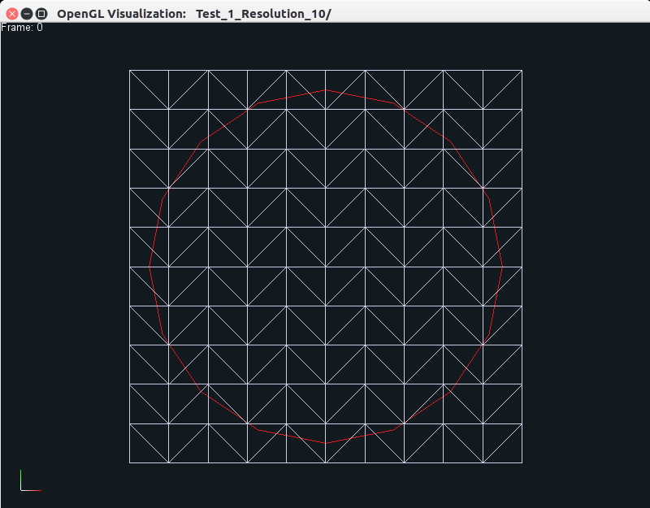
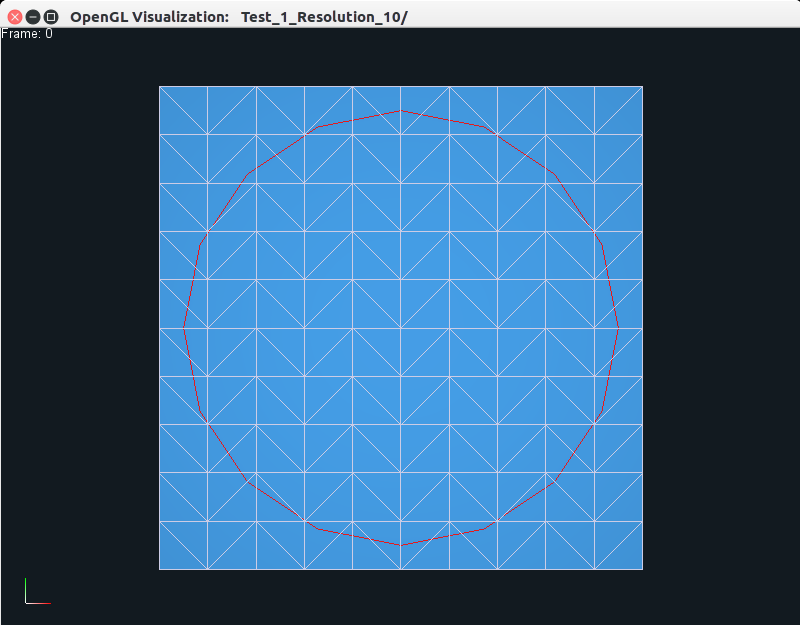

Elasticity Simulation
=====================

Recall that we turned on the following two flags: ``ENABLE_EMBEDDED_DEFORMABLES`` and ``ENABLE_EMBEDDED_DEFORMABLES_PLUGIN``
when we compiled Nova. These two flags allow us to compile the
``embedded_deformables`` project within ``Projects/Nova_Examples`` along with
its OpenGL plugin for visualizing the simulation data. The project supports both
2D and 3D simulations of surface meshes embedded in volumetric elastic bodies, and you should see two binaries named ``embedded_deformables_2d`` and
``embedded_deformables_3d`` in the ``build/bin/`` directory. If you run the 2D
code using the following command: ::

    ./bin/embedded_deformables_2d

then you should see some output being produced on the terminal, along with
a new directory called ``Test_1_Resolution_10``. This data can be visualized
using the following command: ::

    ./bin/opengl Test_1_Resolution_10

which should produce the following output on your screen in a new window.

The left view is the one originally displayed by the viewer, while the middle
and right views can be generated by pressing the CTRL+w keys together, which
allow the user to toggle between the three different views, as shown. The user can zoom in
or out using the middle mouse button, and pan using the left mouse button. The
right mouse button can be used to reposition the object. Users familiar with
`Blender <https://www.blender.org/>`_ may recall that we use the same
functionality for the different mouse buttons. On the top left, you can see a
small text displaying ``Frame 0``, which means that we are viewing data at frame
``0``. The red curve is the surface mesh that is `embedded` in the blue triangulated
area using `barycentric coordinates <https://en.wikipedia.org/wiki/Barycentric_coordinate_system>`_.
